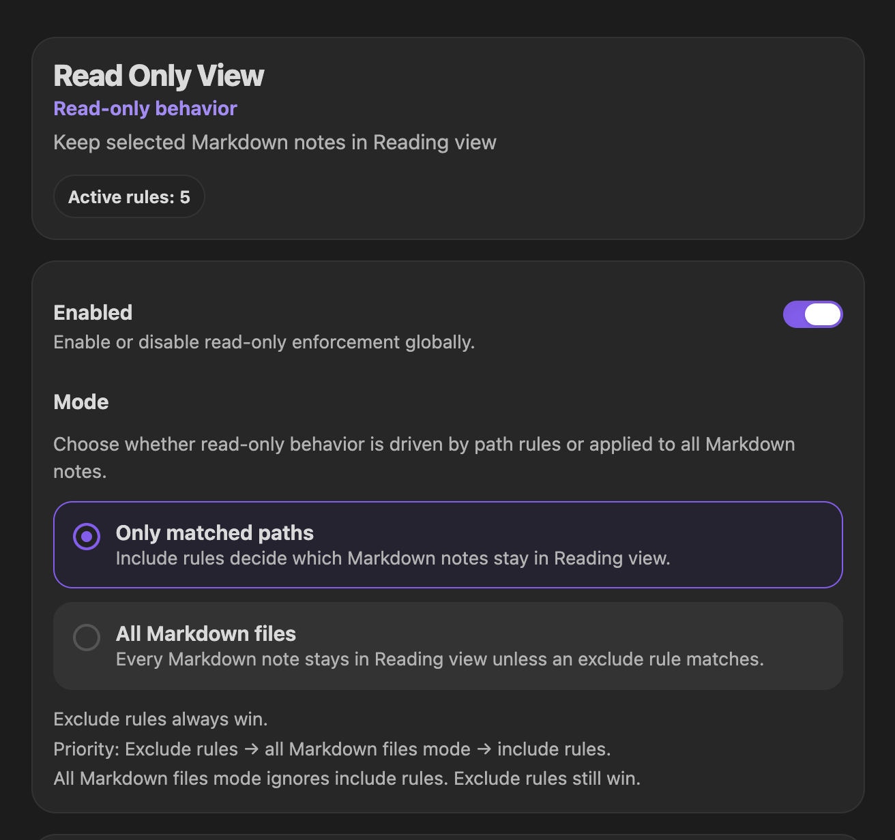
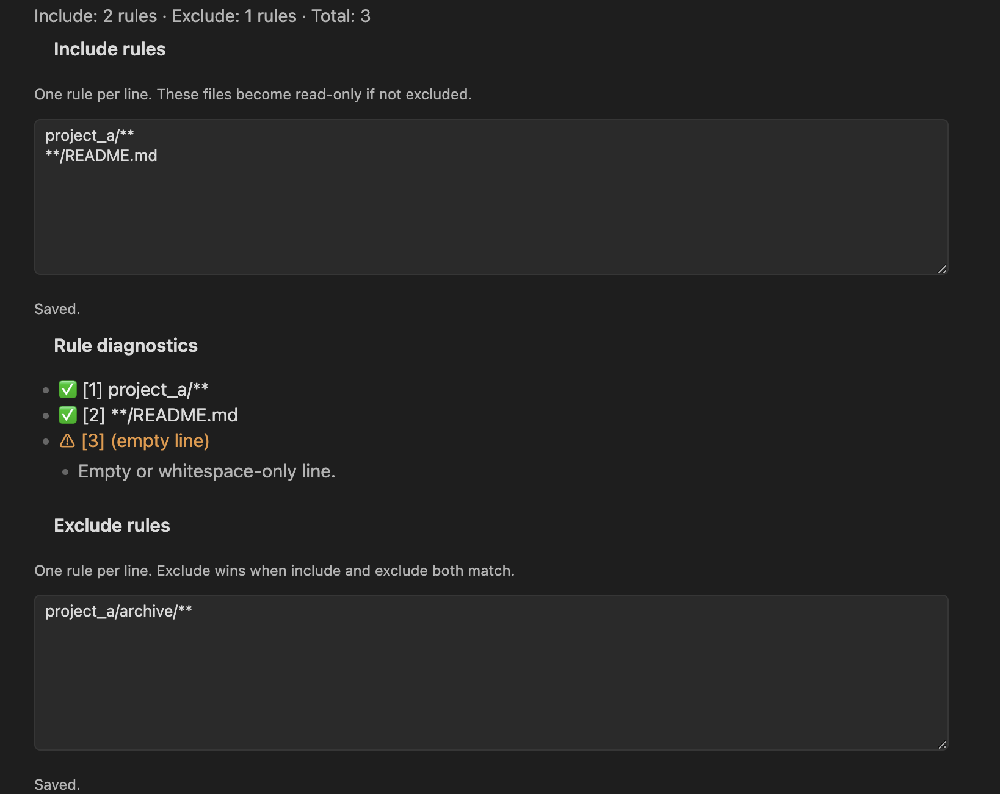

# Read Only View

Keep selected Markdown notes in Obsidian Reading view by matching their vault paths against simple include and exclude rules.

[](https://community.obsidian.md/plugins/read-only-view)

- Community Plugin: available through Obsidian Community Plugins
- Platforms: Desktop and Mobile
- Requires: Obsidian `1.10.3+`
- License: `0BSD`
- Support: [GitHub Issues](https://github.com/mrKazzila/Read-Only-View/issues)

Privacy: no network requests, all rule matching stays local.

## What it does

Read Only View forces matched `.md` notes to stay in Reading view.

- Use include rules to choose which notes should stay read-only.
- Use exclude rules to carve out exceptions.
- Match one folder, one file, or a broader pattern set.
- Use built-in diagnostics and the Path tester when a rule does not behave as expected.

This plugin changes Obsidian view behavior only. It does not change file-system permissions.

Read-only protection uses two layers:

- editor-level input blocking for CodeMirror-backed Markdown editors
- automatic return to Reading view for matched notes as a view-level fallback, including when a read-only editor context is interacted with

This additional editor layer is intended to cover contexts such as Page Preview / Hover Preview more directly, though some edge cases still depend on Obsidian internal view behavior.

## Quick start

By default:

- `Use glob patterns` is off, so rules are matched as plain path prefixes.
- `Case sensitive` is on.
- `Exclude` rules override matching include rules.

First working setup in default mode:

1. Open **Settings → Community plugins → Browse**.
2. Search for `Read Only View`, then **Install** and **Enable** it.
3. Open **Settings → Read Only View**.
4. Make sure `Enabled` is on.
5. In **Include rules**, add a folder rule such as:

```text
projects/
```

6. Open a note inside that folder, for example `projects/plan.md`.
7. The note should stay in Reading view.

If it does not apply:

- confirm the note path starts with `projects/`
- check whether `Case sensitive` matches the actual path casing
- check whether an `Exclude` rule also matches
- run **Re-apply rules now** from the Command Palette
- use the **Path tester** with the exact note path



*A note that matches the configured rules is kept in Reading view.*

## Installation

### Community Plugins

Recommended for normal use.

1. Open **Settings → Community plugins**.
2. Click **Browse**.
3. Search for `Read Only View`.
4. Click **Install**.
5. Click **Enable**.

### BRAT (beta or dev testing)

Use this only to test unreleased changes instead of the Community Plugins release.

1. Install **Obsidian42 - BRAT** from **Settings → Community plugins → Browse**.
2. Open the Command Palette and run **BRAT: Add a beta plugin for testing**.
3. Paste:

```text
https://github.com/mrKazzila/Read-Only-View
```

4. Add the plugin, refresh the plugin list if needed, then enable **Read Only View**.

### Manual installation

Use this only as a fallback for local development or manual testing.

1. Download or build the plugin files.
2. Copy them into:

```text
<Vault>/.obsidian/plugins/read-only-view/
```

3. Required files:
   - `main.js`
   - `manifest.json`
4. Optional file:
   - `styles.css`
5. Restart Obsidian or reload plugins, then enable **Read Only View**.

### Local dev install with `just`

Use this to install a clearly marked local dev build into a test vault without changing the repo `manifest.json`.

```bash
just link-plugin
DEV_PLUGIN_VERSION=999.1.0 just link-plugin
just unlink-plugin
```

- `just link-plugin` symlinks `main.js` and optional `styles.css`, then generates a vault-local `manifest.json` with a DEV label.
- `DEV_PLUGIN_VERSION=... just link-plugin` overrides the default dev manifest version `999.0.0`.
- `just unlink-plugin` removes the local dev copy from the vault after confirmation.
- Dev and release builds use the same plugin ID `read-only-view`, so they cannot coexist in the same vault.
- After `just unlink-plugin`, reinstall the release build from **Community Plugins** if you want to switch back.

## How matching works

- Only Markdown files (`.md`) are affected.
- A note becomes read-only only if at least one include rule matches it.
- If an include rule and an `Exclude` rule both match, the `Exclude` rule wins.
- With `Use glob patterns` off, rules are treated as plain path prefixes.
- With `Use glob patterns` on, rules may use `*`, `**`, and `?`.
- Matching is case-sensitive unless you turn `Case sensitive` off.

Default mode examples:

- `projects/` matches notes under that folder, such as `projects/spec.md`
- `notes/policies/security.md` matches that exact file path

If a rule surprises you, test the exact path in **Path tester** before changing several rules at once.

## Rule examples

### One folder in default mode

`Use glob patterns` off:

```text
Include:
projects/

Exclude:
```

### One exact file path

`Use glob patterns` off:

```text
Include:
notes/policies/security.md

Exclude:
```

### Include a folder, exclude one subfolder

`Use glob patterns` off:

```text
Include:
projects/

Exclude:
projects/drafts/
```

### Glob mode example

Turn `Use glob patterns` on first:

```text
Include:
project_a/**
**/README.md

Exclude:
project_a/archive/**
```

## Commands

Available from the Command Palette:

- `Enable read-only mode`
- `Disable read-only mode`
- `Toggle read-only mode`
- `Re-apply rules now`

`Enable read-only mode` appears only when the plugin is currently disabled.
`Disable read-only mode` appears only when the plugin is currently enabled.

## Diagnostics and path tester

In **Settings → Read Only View**, you can configure:

- `Enabled`
- `Use glob patterns`
- `Case sensitive`
- `Debug logging`
- `Debug: verbose paths`
- `Include rules`
- `Exclude rules`

While editing rules:

- settings are saved automatically after a short delay
- status text shows `Saving...`, `Saved.`, or `Save failed.`
- diagnostics show suspicious or non-effective lines inline
- very large rule sets may cause extra lines to be ignored

Use **Path tester** to paste the exact note path and confirm:

- which include rules matched
- which exclude rules matched
- whether the final result is `READ-ONLY ON` or `READ-ONLY OFF`



*Inline diagnostics help explain why a rule is valid, suspicious, or ignored.*

## Troubleshooting

- A note is not switching to Reading view:
  - confirm the plugin `Enabled` toggle is on
  - confirm the file is a `.md` note
  - confirm at least one include rule matches
  - confirm no `Exclude` rule matches the same path
- A rule looks right but still does not match:
  - copy the exact note path into **Path tester**
  - check path casing if `Case sensitive` is on
  - check whether `Use glob patterns` is off and wildcard characters are being treated literally
- A folder rule matches too broadly:
  - in default mode, remember that matching uses plain path prefixes
  - keep a trailing `/` for folder rules
- Rule changes do not seem to apply yet:
  - wait for `Saved.`
  - run **Re-apply rules now**
  - reopen the note if needed
  - after very rapid view toggles, allow a brief moment for the plugin to retry after the layout burst settles
- Diagnostics show ignored rules:
  - reduce the number of rules
  - merge similar paths where practical
  - prefer broader glob rules only if you intentionally enabled glob mode

## Limitations

- This is not an OS-level read-only lock.
- It only affects Obsidian view behavior for Markdown files.
- It does not protect non-Markdown files.
- It is not a security boundary against other apps, editors, or external tools.

## Development

For local development:

```bash
npm install
npm run lint
npm test
npm run build
```

For installing the plugin into a local test vault, use `just link-plugin`; remove it later with `just unlink-plugin`.

Repository guidance and contributor workflow live in [`CONTRIBUTING.md`](CONTRIBUTING.md).

## License

Licensed under `0BSD`. See [`LICENSE`](LICENSE).
