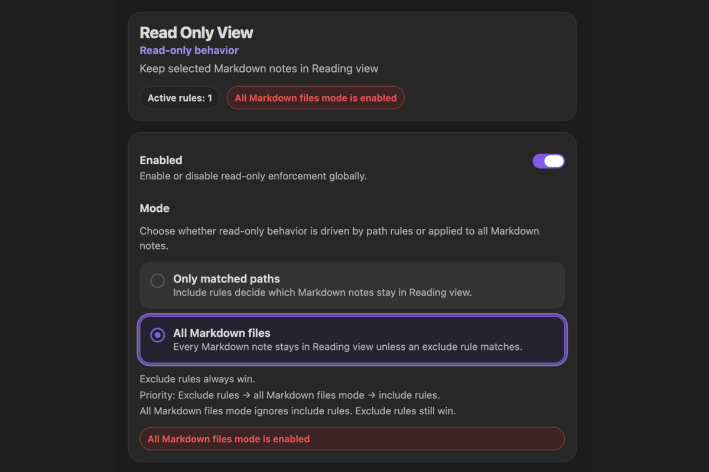
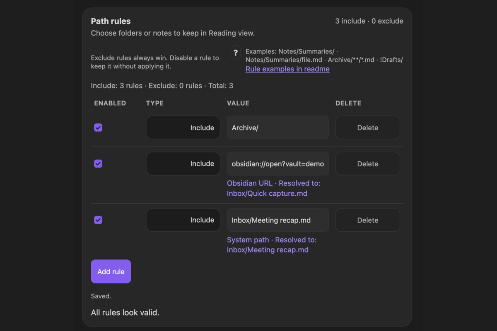
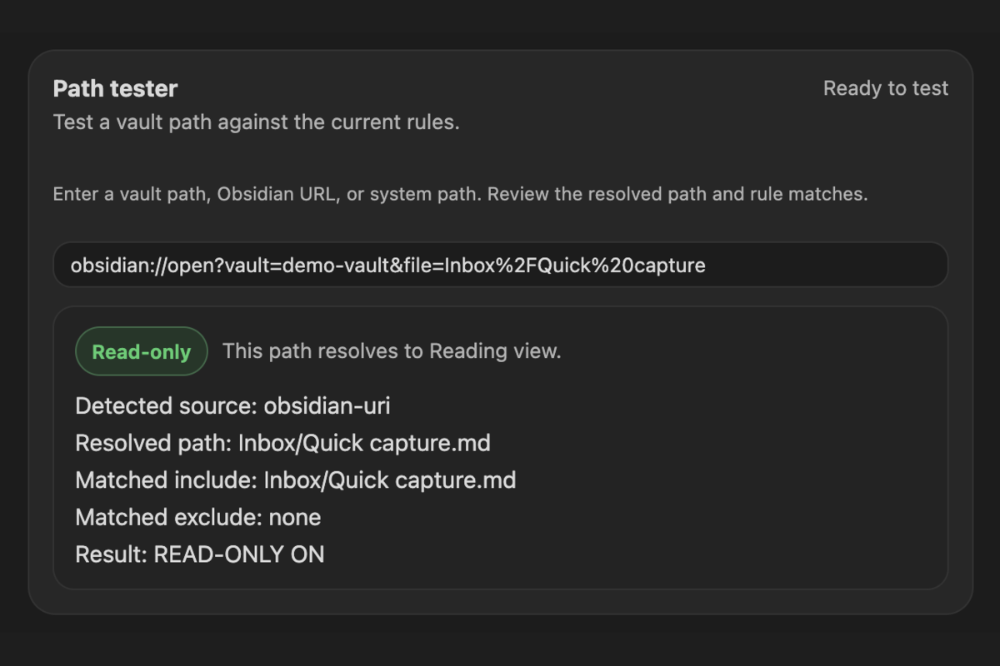
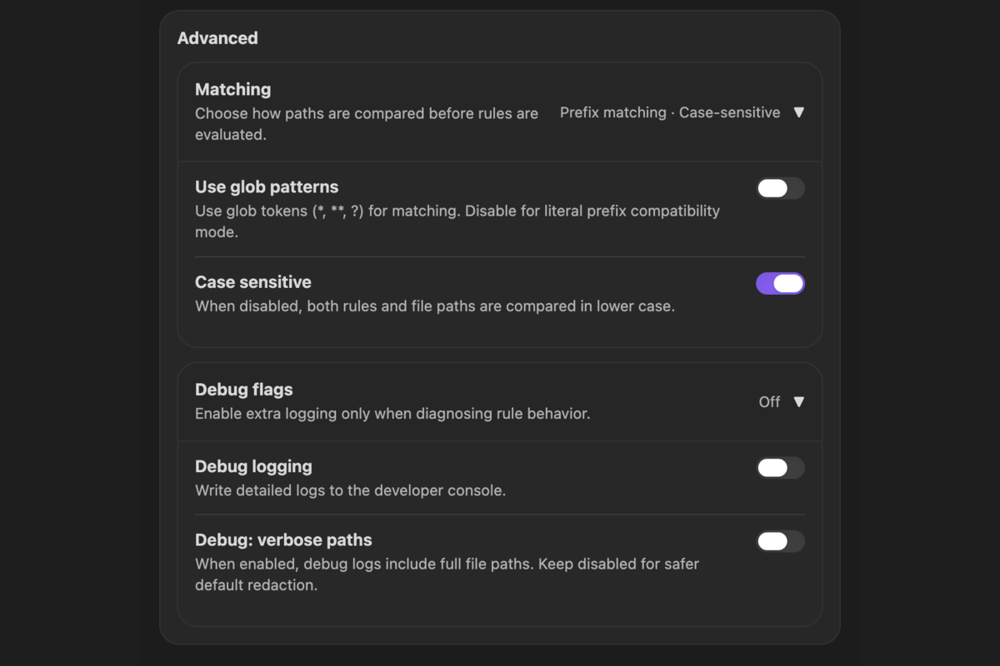

# Read Only View

Keep Markdown notes in Obsidian Reading view, either across the whole vault or only at selected paths.

[](https://community.obsidian.md/plugins/read-only-view)

- Community Plugin: available through Obsidian Community Plugins
- Platforms: Desktop and Mobile
- Requires: Obsidian `1.10.3+`
- License: `0BSD`
- Support: [GitHub Issues](https://github.com/mrKazzila/Read-Only-View/issues)

Privacy: Read Only View makes no network requests, and all rule matching stays local. When you import an absolute system path, the plugin stores only its portable path inside the vault, not the full local path.

## What it does

Read Only View keeps matching `.md` notes in Reading view to help prevent accidental edits.

- Protect every Markdown note with `All Markdown files` mode.
- Protect selected files and folders with `Only matched paths` mode.
- Add include rules for protected notes and exclude rules for exceptions.
- Keep a rule for later while disabling it temporarily.
- Use vault paths, Obsidian URLs, or desktop system paths as rule sources.
- Check a path against the current configuration with the built-in Path tester.

This plugin changes Obsidian view behavior only. It does not change file-system permissions and is not an operating-system security boundary.

Read-only protection uses two layers:

- editor-level input blocking for CodeMirror-backed Markdown editors
- automatic return to Reading view for protected notes, including when a protected editor is interacted with

This additional editor layer is intended to cover contexts such as Page Preview and Hover Preview more directly, though some edge cases still depend on Obsidian's internal view behavior.

## Quick start

On a new installation:

- `Enabled` is on.
- `Mode` is set to `All Markdown files`.
- `Use glob patterns` is off, so ordinary rules use plain path-prefix matching.
- `Case sensitive` is on.
- `Debug logging` and `Debug: verbose paths` are off.
- Exclude rules always take priority.

To protect every Markdown note:

1. Open **Settings → Community plugins → Browse**.
2. Search for `Read Only View`, then **Install** and **Enable** it.
3. Review the welcome window. Select **Open settings** to go directly to the plugin settings.
4. Keep `Enabled` on and leave `Mode` set to `All Markdown files`.
5. Add an exclude rule only if a file or folder should remain editable.

To protect selected paths instead:

1. Open **Settings → Read Only View**.
2. Change `Mode` to `Only matched paths`.
3. Under **Path rules**, select **Add rule**.
4. Keep the rule type set to `Include` and enter a folder such as:

```text
projects/
```

5. Open a note inside that folder, for example `projects/plan.md`.
6. The note should stay in Reading view. Markdown notes outside the matched path remain editable.

If the rule does not apply, paste the exact note path into **Path tester** and check whether an exclude rule also matches.



*All Markdown files mode protects every Markdown note unless an exclude rule matches.*

The welcome window is shown only after a new installation. Plugin updates, re-enabling, and Obsidian restarts do not show it again. It provides a shortcut to the settings page.

## Installation

### Community Plugins

Recommended for normal use.

1. Open **Settings → Community plugins**.
2. Select **Browse**.
3. Search for `Read Only View`.
4. Select **Install**.
5. Select **Enable**.

### BRAT

Use BRAT to test unreleased builds instead of the Community Plugins release.

1. Install **Obsidian42 - BRAT** from **Settings → Community plugins → Browse**.
2. Open the Command Palette and run **BRAT: Add a beta plugin for testing**.
3. Paste:

```text
https://github.com/mrKazzila/Read-Only-View
```

4. Add the plugin, refresh the plugin list if needed, and enable **Read Only View**.

### Manual installation

Use this as a fallback for local development or manual testing.

1. Download or build the plugin files.
2. Copy them into:

```text
<Vault>/.obsidian/plugins/read-only-view/
```

3. Include `main.js` and `manifest.json`. Include `styles.css` when it is provided.
4. Restart Obsidian or reload plugins, then enable **Read Only View**.

## How matching works

Only Markdown files (`.md`) are affected.

The plugin evaluates a note in this order:

1. If an enabled exclude rule matches, the note remains editable.
2. Otherwise, `All Markdown files` mode protects the note.
3. Otherwise, an enabled include rule must match for the note to be protected.

In short: `Exclude rules` → `All Markdown files` → `Include rules`.

### Modes

#### All Markdown files

Every Markdown note stays in Reading view unless an enabled exclude rule matches it.

Saved include rules are retained but inactive in this mode. Their individual enabled states are preserved, so you can switch back to `Only matched paths` without rebuilding the rule list.

#### Only matched paths

A Markdown note stays in Reading view only when an enabled include rule matches and no enabled exclude rule matches.

Changing or deleting rules does not change the selected mode. An empty rule list is valid; in `Only matched paths` mode, it means that no notes are protected.


*Only matched paths mode uses enabled include rules to decide which notes stay in Reading view.*

### Ordinary vault paths

With `Use glob patterns` off, rules are matched as plain path prefixes:

- `projects/` matches notes inside that folder, such as `projects/spec.md`.
- `notes/policies/security.md` matches that note path.

Keep a trailing `/` when you intend to match a folder. Matching is case-sensitive unless you turn `Case sensitive` off.

With `Use glob patterns` on, rules may use `*`, `**`, and `?`.

### Import a note or folder

The Value field accepts three source formats:

```text
Inbox/Quick capture.md
obsidian://open?vault=demo-vault&file=Inbox%2FQuick%20capture
/Users/name/vaults/demo-vault/Inbox/Quick capture.md
/Users/name/vaults/demo-vault/Knowledge Base/Productivity/
```

- A vault path keeps the normal prefix or glob behavior selected in **Advanced → Matching**.
- A vault path copied without `.md` resolves to that Markdown note when it already exists. An existing folder copied without a trailing `/` is normalized to a folder rule automatically. Add `/` explicitly when a note and folder share the same name and you intend to target the folder.
- An `obsidian://open` URL targets one existing Markdown note. It must reference the current vault. The `.md` extension may be omitted, and heading or block locators do not change which note is matched.
- An absolute system path can point to an existing Markdown note or folder inside the current vault. Importing system paths is available on desktop.

An imported file becomes an exact rule. An imported folder keeps ordinary folder matching behavior. Once a system path is imported, the saved vault-relative path remains portable to mobile devices and does not expose the original absolute path.

If a URL or system path cannot be resolved, the value stays visible so you can correct it, but it does not participate in matching or the active-rule count.

## Rule examples

### Protect one folder

Set `Mode` to `Only matched paths` and keep `Use glob patterns` off:

```text
Type: Include
Value: projects/
```

### Protect one exact file

Set `Mode` to `Only matched paths` and keep `Use glob patterns` off:

```text
Type: Include
Value: notes/policies/security.md
```

You can also paste an Obsidian URL for an existing note to create an exact-file rule.

### Protect a folder with an editable exception

Set `Mode` to `Only matched paths` and add:

```text
Type: Include
Value: projects/

Type: Exclude
Value: projects/drafts/
```

Notes under `projects/drafts/` remain editable because exclude rules always win.

### Keep one folder editable in global mode

Set `Mode` to `All Markdown files` and add:

```text
Type: Exclude
Value: workspace/
```

All other Markdown notes remain protected, while notes under `workspace/` stay editable.

### Glob mode

Turn `Use glob patterns` on first:

```text
Type: Include
Value: project_a/**

Type: Include
Value: **/README.md

Type: Exclude
Value: project_a/archive/**
```

## Settings and diagnostics

The settings screen is organized around the main workflow:

- The header shows the current number of active rules and warns when `All Markdown files` mode is enabled.
- The header remains a separate card, followed by one card containing the global `Enabled` toggle and both mode choices.
- **Path rules** contains one table for include and exclude rules.
- **Path tester** explains how a source resolves and whether the resulting note is protected.
- **Advanced** contains collapsible `Matching` and `Debug flags` sections.

Each section title is contained in its single section card; the settings UI does not add a second heading or outer frame around these cards. Top-level cards stay aligned with compact spacing, with extra separation before **Path rules** to distinguish configuration from rule management.

### Path rules

Each row contains:

- an `Enabled` checkbox
- an `Include` or `Exclude` type selector
- one Value field that detects vault paths, Obsidian URLs, and system paths
- a Delete button

Disable a row when you want to keep it without applying it. Disabled rules do not participate in matching, diagnostics, or active-rule counts. In `All Markdown files` mode, include rows are shown as inactive while exclude rows continue to work.

Resolved vault note and folder paths, Obsidian URLs, and system paths show the corresponding normalized vault path below the Value field. Invalid values show an inline explanation. The rules summary and diagnostics reflect the rows that can actually participate in matching.



*The unified rule editor resolves advanced sources to portable paths inside the vault.*

### Path tester

Paste a vault path, Obsidian URL, or system path into **Path tester**. It shows:

- the detected source type
- the resolved vault path
- matching include and exclude rules
- whether the all-Markdown preset determines the result
- the final `Read-only` or `Editable` status

For a system folder, the tester shows the resolved folder and asks for a specific Markdown note before evaluating rule matches.



*A resolved Obsidian URL matches an include rule and is reported as read-only.*

### Mobile and tablet layout

On narrow phone and tablet settings panes, the interface switches to a stacked layout so rule controls, descriptions, resolved paths, and errors remain readable. Rules created from a system path on desktop continue to work from their saved vault-relative paths on mobile.

Changing a rule between `Include` and `Exclude` updates the existing row in place, so the mobile system picker closes normally after a selection.

### Advanced

The `Matching` and `Debug flags` sections are collapsed by default and expand inline. Their summaries show the current state, and their individual controls remain discoverable through settings search. Open `Matching` to switch between prefix and glob matching or to change case sensitivity. Debug options are intended only for diagnosing rule behavior.



*Advanced keeps matching and diagnostic controls out of the primary workflow until they are needed.*

## Commands

Available from the Command Palette:

- `Enable read-only mode`
- `Disable read-only mode`
- `Toggle read-only mode`
- `Re-apply rules now`

`Enable read-only mode` appears only when the plugin is disabled. `Disable read-only mode` appears only when it is enabled.

Use `Re-apply rules now` when you want to enforce the current configuration immediately across open Markdown notes.

## Troubleshooting

- A note is not switching to Reading view:
  - confirm that `Enabled` is on
  - confirm that the file is a Markdown note
  - in `Only matched paths` mode, confirm that an enabled include rule matches
  - confirm that no enabled exclude rule matches
- A note should remain editable in `All Markdown files` mode:
  - add an enabled exclude rule for the note or its folder
  - verify the exact path with **Path tester**
- A saved include rule is not active:
  - include rules are ignored while `All Markdown files` mode is selected
  - confirm that the row's `Enabled` checkbox is selected
- A vault path rule looks right but does not match:
  - check path casing if `Case sensitive` is on
  - check whether wildcard characters are being treated literally because `Use glob patterns` is off
  - keep a trailing `/` when the rule is intended for a folder
- An Obsidian URL cannot be resolved:
  - use an `obsidian://open` URL
  - confirm that it names the current vault and an existing Markdown note
- A system path cannot be imported:
  - import it from the desktop app
  - confirm that it points to an existing Markdown note or folder inside the current vault
- Recent changes do not seem to apply:
  - wait until the settings show `Saved.`
  - run `Re-apply rules now`
  - reopen the note if needed

## Limitations

- Read Only View is not an OS-level read-only lock.
- It affects only Markdown files opened in Obsidian.
- It does not protect non-Markdown files.
- It is not a security boundary against other plugins, applications, editors, or external tools.
- Advanced sources must resolve to existing items in the current vault; the plugin does not automatically follow later file renames.

## Development

For local development:

```bash
npm install
npm run lint
npm test
npm run build
```

Equivalent `just` recipes are available. Use `just link-plugin` to link a local build into the repo's demo vault by default, and `just unlink-plugin` to remove that local install.

Repository guidance and contributor workflow live in [CONTRIBUTING.md](CONTRIBUTING.md).

## License

Licensed under `0BSD`. See [LICENSE](LICENSE).
