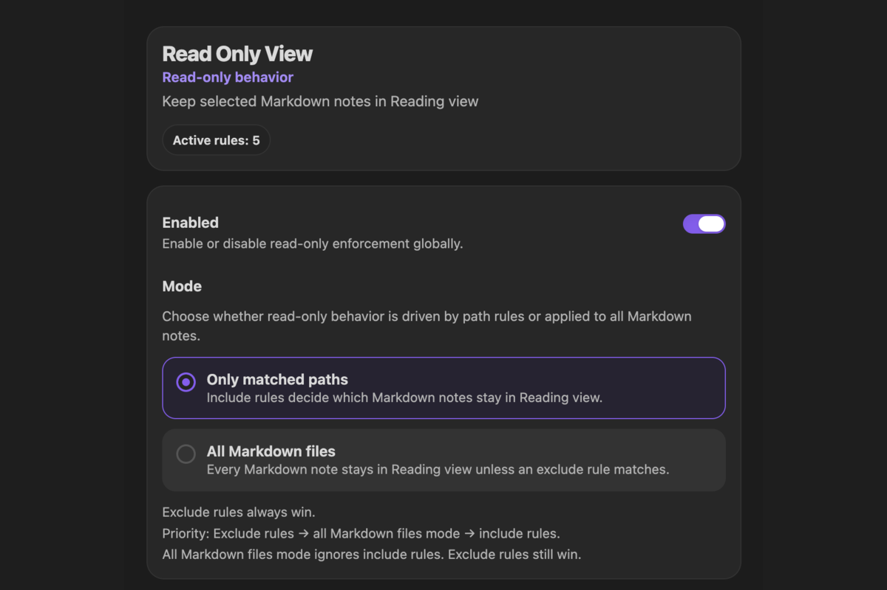

## Get started

In Obsidian, open **Settings → Community plugins → Browse**, search for **Read Only View**, then select **Install** and **Enable**. Requires Obsidian **1.10.3 or newer**; supports desktop and mobile.

::: tip Choose your scope
New installations use **All Markdown files** mode. To protect selected notes or folders, open **Settings → Read Only View**, select **Only matched paths**, and add an **Include** rule under **Path rules**.
:::

## Find your workflow

- [How do I keep all Obsidian notes in Reading view?](./guides/make-all-notes-read-only.md): use **All Markdown files** or an Include glob `**`.
- [Make one note read-only](./guides/make-note-read-only.md): keep a reference note in Reading view.
- [Make a folder read-only](./guides/make-folder-read-only.md): protect `Reference/` or `Archive/` while leaving drafts editable.
- [Prevent accidental editing](./guides/prevent-accidental-editing.md): separate reading from deliberate editing.
- [Use Reading view on mobile](./guides/mobile-reading-view.md): browse notes on a phone or tablet.

See [Path rules](./docs/path-rules.md) for matching syntax and [Path tester](./docs/path-tester.md) for diagnostics.

## Questions about path rules

- [How do I keep daily notes editable in a read-only vault?](./guides/make-all-notes-read-only.md#except-daily-notes)
- [How do I protect a folder without its subfolders?](./guides/make-folder-read-only.md#without-subfolders)
- [Why is my note read-only or still editable?](./docs/troubleshooting.md)

- [Can I protect a folder but leave one note editable?](./guides/make-folder-read-only.md#leave-one-note-editable)
- [Can I use an Obsidian URL, system path, or vault path?](./docs/path-rules.md#import-a-note-or-folder)
- [Can I temporarily disable a rule without deleting its path?](./docs/path-rules.md#temporarily-disable-rules)
- [How do I check whether a note will be read-only?](./docs/path-tester.md#test-a-note)
- [Can I use wildcards in path rules?](./docs/path-rules.md#glob-patterns)
- [Can I make path matching case-sensitive?](./docs/path-rules.md#case-sensitivity)

## What protection means

Read Only View returns matching Markdown notes to Reading view and blocks editor input in supported Markdown editors. It changes Obsidian view behavior; it does not change filesystem permissions, rewrite your Markdown files, or prevent other applications from editing them. See the [FAQ](./faq.md) for limitations and temporary editing.
